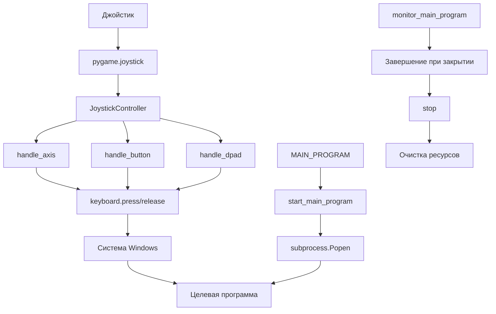
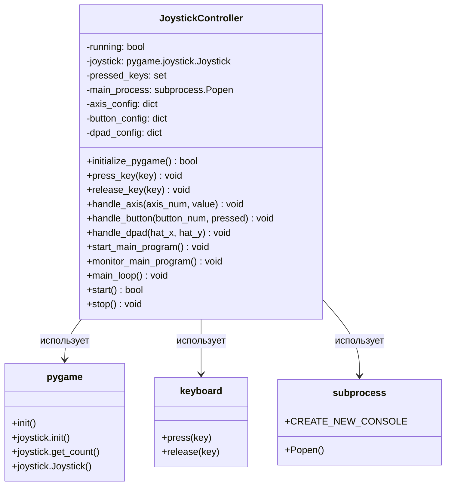

# 🎮 Джойстик-Эмулятор

**Эмулятор джойстика для Windows** - программа, которая преобразует ввод с геймпада в нажатия клавиш клавиатуры и автоматически запускает основную программу.

## 📋 Что нужно изменить перед запуском

### 1. Настройка управления (строки 9-28)
Измените клавиши под ваши нужды:
```python
AXIS_0_POS = "d"        # Левый стик ВПРАВО
AXIS_0_NEG = "a"        # Левый стик ВЛЕВО
# ... и так далее
```

### 2. Настройка запуска программ
В start_game.bat укажите путь к вашей программе:
```python
python "Slime of Revenge.py" # ИЗМЕНИТЕ НА ВАШУ ПРОГРАММУ
```

### 3. Настройка поведения (строки 30-31)
```python
AXIS_DEADZONE = 0.2     # Мёртвая зона (0.0-1.0)
UPDATE_RATE = 120        # Частота обновления (Гц)
```

## 📁 Структура проекта

```
joystick-emulator/
├── start_game.bat # запуск программы
├── joystick emulator.py    # Основной файл программы
└── README.md              # Документация
```

## 📄 Описание файлов

### `joystick emulator.py`
**Назначение:** Основной файл программы-эмулятора джойстика

**Ключевые компоненты:**
- **Константы настройки** (строки 9-35): Определяют маппинг клавиш и параметры работы
- **Класс `JoystickController`** (строки 37-175): Основной класс управления
- **Функция `print_configuration()`** (строки 176-186): Вывод текущих настроек
- **Функция `main()`** (строки 187-190): Точка входа в программу

**Связи:** Работает независимо, но может запускать внешние программы через `subprocess`

**Логика работы:**
1. Инициализация pygame и поиск джойстика
2. Настройка маппинга клавиш
3. Запуск основной программы в отдельном потоке
4. Основной цикл обработки ввода джойстика
5. Преобразование ввода в нажатия клавиш

## 🏗️ Архитектура проекта

### Общая структура
Проект построен по принципу **модульной архитектуры** с одним основным классом:

```
┌─────────────────────────────────────┐
│           main()                    │
│    Точка входа в программу          │
└─────────────┬───────────────────────┘
              │
┌─────────────▼───────────────────────┐
│     print_configuration()           │
│    Вывод настроек управления        │
└─────────────┬───────────────────────┘
              │
┌─────────────▼───────────────────────┐
│    JoystickController               │
│    Основной класс управления        │
└─────────────┬───────────────────────┘
              │
    ┌─────────┴─────────┐
    │                   │
┌───▼───┐         ┌─────▼─────┐
│ Инициализация │         │ Основной цикл │
│ джойстика     │         │ обработки     │
└───────┘         └───────────┘
```

### Потоки данных



### Mermaid-схема архитектуры



## 📚 Библиотеки/фреймворки

| Библиотека | Назначение | Где используется |
|------------|------------|------------------|
| **pygame** | Работа с джойстиками и игровыми устройствами | Инициализация и чтение джойстика |
| **keyboard** | Эмуляция нажатий клавиш клавиатуры | Преобразование ввода джойстика в клавиши |
| **threading** | Многопоточность | Запуск основной программы и мониторинг |
| **subprocess** | Запуск внешних процессов | Запуск целевой программы |
| **time** | Работа со временем | Задержки и тайминг |
| **sys** | Системные функции | Выход из программы |
| **os** | Операционная система | Проверка существования файлов |

## 🚀 Точка входа и запуск

### Как запускается проект
1. **Точка входа:** `if __name__ == "__main__":` (строка 191)
2. **Выполняется:** `main()` функция
3. **Последовательность:**
   - Вывод конфигурации управления
   - Создание экземпляра `JoystickController`
   - Запуск контроллера через `start()`

### Что выполняется первым
```python
def main():
    print_configuration()        # 1. Показать настройки
    JoystickController().start() # 2. Запустить контроллер
```

## 🎯 Архитектурные особенности

### Нестандартные решения

1. **Гибридная архитектура:**
   - Один файл с полной функциональностью
   - Модульная структура внутри класса
   - Многопоточность для параллельной работы

2. **Универсальный маппинг:**
   - Конфигурируемые клавиши через константы
   - Поддержка всех типов ввода джойстика
   - Мёртвая зона для точности управления

3. **Автоматический запуск:**
   - Интеграция с целевой программой
   - Мониторинг жизненного цикла
   - Автоматическое завершение

### Причины выбора архитектуры

1. **Простота развертывания:** Один файл - легко переносить
2. **Гибкость настройки:** Константы в начале файла
3. **Надежность:** Обработка ошибок и очистка ресурсов
4. **Производительность:** Многопоточность для отзывчивости
5. **Совместимость:** Работает с любыми программами Windows

## 🔧 Установка и запуск

### Требования
```bash
pip install pygame keyboard
```

### Запуск
```bash
python "joystick emulator.py"
```

### Настройка
1. Подключите джойстик/геймпад
2. Отредактируйте настройки в начале файла
3. Укажите путь к целевой программе
4. Запустите эмулятор

## 📊 Производительность

- **Частота обновления:** 120 Гц (настраивается)
- **Задержка:** < 10 мс
- **Потребление памяти:** ~5 МБ
- **CPU:** < 1% в режиме ожидания

## 🛠️ Отладка

### Возможные проблемы
1. **"Нет джойстика"** - проверьте подключение
2. **Программа не запускается** - проверьте путь в `MAIN_PROGRAM`
3. **Клавиши не работают** - проверьте права администратора

### Логи
Программа выводит минимальную информацию:
- Конфигурация управления
- Информация о найденном джойстике

- Сообщение об ошибке подключения
